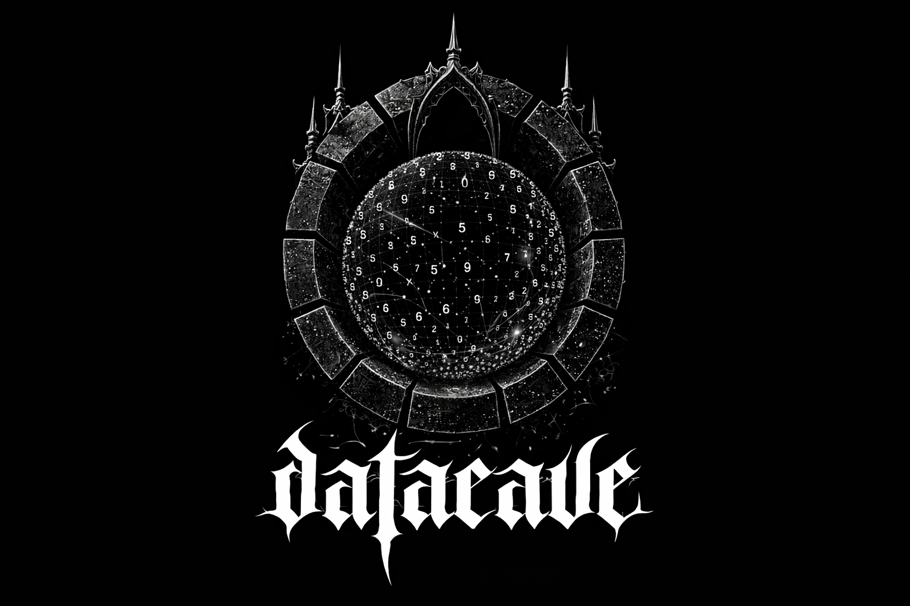

# Datacave



Datacave is a high-performance, distributed SQL database built in Rust. It couples an LSM-based storage engine with PostgreSQL wire compatibility and horizontal scaling, aiming to provide a familiar SQL interface with modern storage performance.

## Highlights

- LSM-backed storage for write-heavy workloads and efficient compactions
- PostgreSQL wire protocol support for easy client connectivity
- Modular Rust workspace with clean crate boundaries
- Focus on performance, observability, and correctness

## Architecture Overview

Datacave is organized as a set of focused crates that compose into a full database server:

- `datacave-core`: core types, errors, catalog, and shared traits
- `datacave-lsm`: LSM storage engine
- `datacave-sql`: SQL parsing, planning, and execution
- `datacave-protocol`: PostgreSQL wire protocol handling
- `datacave-server`: server binary and connection handling

Data flows from protocol handling to query planning and execution, then into the LSM engine for storage. This separation keeps the wire protocol, SQL layer, and storage engine independently testable and replaceable.

## Getting Started

### Prerequisites

- Rust toolchain (stable)
- A Postgres-compatible client (`psql`, DBeaver, or a language driver)

### Run the Server

```
cargo run -p datacave-server -- serve --config config.example.toml
```

### Connect with psql

```
psql "host=127.0.0.1 port=5432 user=datacave dbname=default"
```

## Configuration

Datacave loads configuration from a TOML file. The `config.example.toml` file documents the available options and defaults. Typical settings include:

- Listen address and port
- Storage path and engine options
- Logging verbosity
- Protocol and session limits

## Development

### Workspace Layout

This repository is a Rust workspace. Build, test, and run components using Cargo workspace commands.

### Build

```
cargo build --workspace
```

### Test

```
cargo test --workspace
```

### Lint and Format

```
cargo fmt --all
cargo clippy --workspace --all-targets
```

## Security and Encryption

Datacave includes encryption primitives and is designed to keep storage and protocol concerns isolated. Review the `datacave-lsm` crate for storage-level details and the server crate for authentication and session handling.

## Roadmap

- Improved SQL coverage and query planning optimizations
- Advanced compaction and caching strategies
- Cluster membership and replication tooling
- Extended observability (metrics and tracing)

## Contributing

Issues and pull requests are welcome. Please keep changes scoped, add tests for new behavior, and follow the existing crate boundaries and conventions.

## License

See the repository license for details.
